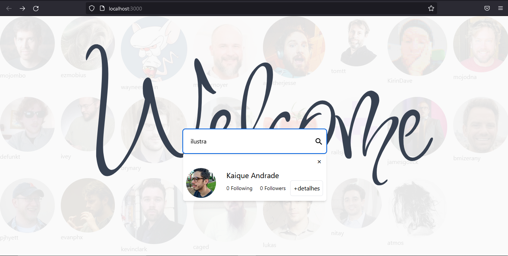

# Projeto em React JS usando api do GitHub

Projeto foi desenvolvido para testar como seria a construção do React Js usando classes implmentando view e services para gerenciamento do Crud.

### 🔧 Necessários 

    Instalação do NodeJS versão lts
    npm install || yarn install
    npm start || yarn start
## 🛠️ Construído com

Ferramentas usadas para criação do projeto

* [ReactJS ](https://pt-br.reactjs.org/) - Site Web da documetação React
* [api GitHub](https://api.github.com) - Api consumida no projeto

## Imagens
home da tela inicial do projeto

Detalhes do repositórios 

* **Um desenvolvedor** - *Suporte e colaboração* - [Kaique Andrade](https://github.com/Ilustra)

---
⌨️ com ❤️ por [Kaique Andrade](https://github.com/Ilustra) 😊